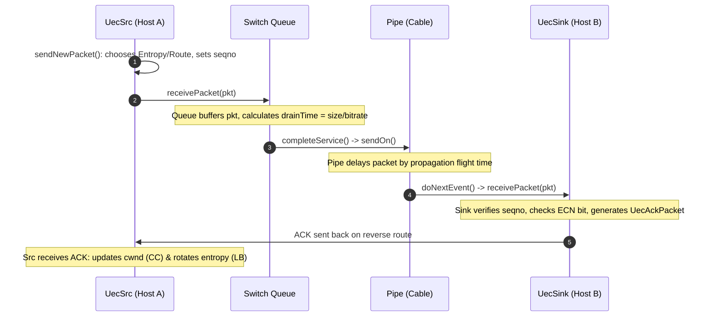

# HTSIM Simulation Tool: A Beginner's Baby-Steps Guide

Welcome to the team! This guide is written specifically for you as a Junior Network Engineer. We will build your understanding from the ground up—starting with the fundamental concepts of network simulation, moving to how the **HTSIM** (High-Throughput Simulator) C++ codebase is designed, and walking through actual code snippets with step-by-step explanations.

---

## Table of Contents
1. [Part 1: Network Simulation Fundamentals & Key Terms](#part-1-network-simulation-fundamentals--key-terms)
2. [Part 2: The Core Architecture of HTSIM](#part-2-the-core-architecture-of-htsim)
3. [Part 3: The Engine Room — `EventList` and Virtual Time](#part-3-the-engine-room--eventlist-and-virtual-time)
4. [Part 4: The Physical Metaphor — Packets, Queues, Pipes, and Routes](#part-4-the-physical-metaphor--packets-queues-pipes-and-routes)
5. [Part 5: Step-by-Step Walkthrough: Life of a Packet in HTSIM](#part-5-step-by-step-walkthrough-life-of-a-packet-in-htsim)
6. [Part 6: Load Balancing & Congestion Control in HTSIM (UEC / REPS)](#part-6-load-balancing--congestion-control-in-htsim-uec--reps)
7. [Part 7: Code Deep-Dives with Line-by-Line Explanations](#part-7-code-deep-dives-with-line-by-line-explanations)
8. [Part 8: Practical Guide: Building, Running & CLI Options](#part-8-practical-guide-building-running--cli-options)
9. [Part 9: Quick Reference Cheat Sheet](#part-9-quick-reference-cheat-sheet)

---

## Part 1: Network Simulation Fundamentals & Key Terms

Before looking at C++ classes, let's understand *why* we simulate networks and the core terminology.

### Why Not Just Test on Real Hardware?
In modern data centers, networks run at 100 Gbps, 400 Gbps, or 800 Gbps with thousands of servers and switches. Building testbeds of this scale to test a new algorithm is:
- **Prohibitively expensive** (millions of dollars in switches, cables, NICs).
- **Hard to debug** (you can't pause the universe to inspect a single queue at microsecond $14.2$).
- **Non-deterministic** (hard to reproduce an exact race condition).

A network simulator runs the protocol logic on your laptop or a server in a fully reproducible software environment.

---

### What is Discrete-Event Simulation (DES)?

In a video game or real-time simulation, time advances continuously tick-by-tick (e.g., 60 frames/sec: $t=0, 16\text{ms}, 32\text{ms}, \dots$).

In **Discrete-Event Simulation (DES)**:
1. Nothing happens between events.
2. The simulation clock **jumps directly** from the timestamp of the current event to the timestamp of the next earliest event in a priority queue.
3. If a packet is transmitted at $t=10\,\mu\text{s}$ and the wire delay is $5\,\mu\text{s}$, the simulator schedules a `ReceivePacket` event at $t=15\,\mu\text{s}$ and immediately leaps to $t=15\,\mu\text{s}$ (skipping all idle time in between).

```
   Event 1: Packet Sent          [Nothing happens on wire]         Event 2: Packet Arrives
       (t = 10.0 µs) ──────────────────────────────────────────────>   (t = 15.0 µs)
                             ^ Clock jumps directly here ^
```

---

### Key Networking Terminology

Here is a quick glossary of terms used all across HTSIM:

| Term | What It Means | Real-World Analog |
|---|---|---|
| **FCT (Flow Completion Time)** | The total time from when a sender starts sending a flow until the last byte is acknowledged. Lower is better! | Delivery time for a package. |
| **BDP (Bandwidth-Delay Product)** | $\text{Capacity} \times \text{RTT}$. The number of bytes required to keep the pipe completely full. | The volume of water inside a hose. |
| **Transmission (Serialization) Delay** | The time it takes a transmitter to push all bits of a packet onto the physical wire: $\frac{\text{Packet Size (bits)}}{\text{Link Bandwidth (bps)}}$. | Time taken to push boxes one by one through a doorway. |
| **Propagation Delay** | The physical flight time of signals traveling through glass/copper: $\frac{\text{Cable Length}}{\text{Speed of Light in Medium}}$ ($\approx 5\,\text{ns/meter}$). | Time the train takes to travel between stations. |
| **Queuing Delay** | Time a packet spends waiting in a switch buffer because the egress port is busy sending other packets. | Waiting in line at the grocery store checkout. |
| **RTT (Round-Trip Time)** | Total time for a packet to reach the destination plus the time for the ACK to return. | Sending a letter and receiving a reply. |
| **ECN (Explicit Congestion Notification)** | Switches mark bits in packet headers when queue depth exceeds a threshold, warning senders to slow down before packet drops occur. | A yellow warning light on the highway. |
| **ECMP (Equal-Cost Multi-Path)** | Switches hash packet 5-tuples (Src IP, Dst IP, Src Port, Dst Port, Protocol + Entropy) to pick one of several identical-cost links. | Choosing a highway lane based on your license plate number. |
| **Fat-Tree Topology** | A hierarchical data center network structure (ToR/Leaf $\leftrightarrow$ Aggregation/Spine $\leftrightarrow$ Core) providing multiple redundant bisection paths. | A multi-lane pyramid highway system. |

---

## Part 2: The Core Architecture of HTSIM

HTSIM is written in modular, object-oriented C++. Almost every physical concept in a network maps directly to a C++ class.

```
┌────────────────────────────────────────────────────────────────────────┐
│                               EVENTLIST                                │
│           (Global scheduler: manages virtual time in picoseconds)      │
└───────────────────▲────────────────────────────────▲───────────────────┘
                    │ schedules events               │ schedules events
┌───────────────────┴─────────────┐    ┌─────────────┴───────────────────┐
│              Queue              │    │              Pipe               │
│   (Serialization & Buffering)   │    │      (Propagation Delay)        │
└─────────────────────────────────┘    └─────────────────────────────────┘
                    ▲                                    ▲
                    │                                    │
                    └──────────── PacketSink ────────────┘
                        (Base interface for hops)
                                  ▲
                                  │ routes through
                              [ Packet ]
```

### The Class Hierarchy

1. **`EventSource`** ([`htsim/sim/eventlist.h`](file:///C:/git_repos/REPS_EuroSys_Artifact/htsim/sim/eventlist.h)):
   - An abstract base class for any object that can trigger an action at a future timestamp.
   - Requires implementing `virtual void doNextEvent() = 0`.
2. **`PacketSink`** ([`htsim/sim/network.h`](file:///C:/git_repos/REPS_EuroSys_Artifact/htsim/sim/network.h)):
   - An abstract interface representing any entity capable of receiving a packet.
   - Requires implementing `virtual void receivePacket(Packet& pkt) = 0`.
3. **`Pipe`** ([`htsim/sim/pipe.h`](file:///C:/git_repos/REPS_EuroSys_Artifact/htsim/sim/pipe.h)):
   - Represents a physical cable. Inherits from both `PacketSink` (receives a packet at one end) and `EventSource` (delivers it at the other end after propagation delay).
4. **`Queue` / `BaseQueue`** ([`htsim/sim/queue.h`](file:///C:/git_repos/REPS_EuroSys_Artifact/htsim/sim/queue.h)):
   - Represents a switch egress port buffer. Manages queue capacity, drops or marks packets (ECN), and models transmission delay.
5. **`Route`** ([`htsim/sim/route.h`](file:///C:/git_repos/REPS_EuroSys_Artifact/htsim/sim/route.h)):
   - An ordered list of `PacketSink*` pointers (`[HostQueue* -> Pipe* -> SwitchQueue* -> Pipe* -> ... -> Sink*]`).
6. **`Packet`** ([`htsim/sim/network.h`](file:///C:/git_repos/REPS_EuroSys_Artifact/htsim/sim/network.h)):
   - The message unit carrying headers, payload size, route pointer, flags (ECN), and path entropy.
7. **`UecSrc` & `UecSink`** ([`htsim/sim/uec.h`](file:///C:/git_repos/REPS_EuroSys_Artifact/htsim/sim/uec.h)):
   - The transport layer end-hosts (Ultra Ethernet Consortium style transport with NSCC congestion control and REPS load balancing).

---

## Part 3: The Engine Room — `EventList` and Virtual Time

### Time Representation: Picoseconds
In high-speed networks (400 Gbps), a 4KB packet takes only ~80 nanoseconds to transmit. To avoid floating-point rounding errors, HTSIM represents all virtual time internally as a 64-bit unsigned integer in **picoseconds** ($1\,\text{ps} = 10^{-12}\,\text{s}$):

- $1\,\text{second} = 10^{12}\,\text{ps}$
- $1\,\text{millisecond (ms)} = 10^9\,\text{ps}$
- $1\,\text{microsecond (\mu s)} = 10^6\,\text{ps}$
- $1\,\text{nanosecond (ns)} = 10^3\,\text{ps}$

Helper functions in [`htsim/sim/config.h`](file:///C:/git_repos/REPS_EuroSys_Artifact/htsim/sim/config.h) do conversions:
```cpp
simtime_picosec t1 = timeFromUs(5);   // 5 microseconds -> 5,000,000 picoseconds
simtime_picosec t2 = timeFromNs(100); // 100 nanoseconds -> 100,000 picoseconds
double us = timeAsUs(t1);             // converts picoseconds back to double (5.0)
```

### How the `EventList` Works
The `EventList` contains a priority queue implemented as an ordered `std::multimap<simtime_picosec, EventSource*>`.

```cpp
// From htsim/sim/eventlist.cpp
bool EventList::doNextEvent() {
    if (_pendingsources.empty())
        return false; // Simulation finished!

    // 1. Get the earliest event in time
    simtime_picosec nexteventtime = _pendingsources.begin()->first;
    EventSource* nextsource = _pendingsources.begin()->second;
    _pendingsources.erase(_pendingsources.begin());

    // 2. Advance the global clock
    _lasteventtime = nexteventtime;

    // 3. Execute the event
    nextsource->doNextEvent();
    return true;
}
```

The entire simulation is just a loop around this function in `main()`:
```cpp
while (eventlist.doNextEvent()) {
    // Keep running until time limit or all events finish
}
```

---

## Part 4: The Physical Metaphor — Packets, Queues, Pipes, and Routes

Let's see how physical network components are modeled in software.

### 1. `Pipe`: The Wire (Propagation Delay)
A `Pipe` does only one thing: it holds a packet for a fixed duration ($\text{delay}$) and then pushes it to the next hop.

```cpp
// When a packet enters the cable:
void Pipe::receivePacket(Packet& pkt) {
    if (_failed) { // Simulated link failure / cut cable
        pkt.free();
        return;
    }
    // Schedule arrival at (current_time + propagation_delay)
    simtime_picosec arrival_time = eventlist().now() + _delay;
    _inflight_v.push_back({arrival_time, &pkt});
    eventlist().sourceIsPending(*this, arrival_time);
}

// When the arrival time is reached:
void Pipe::doNextEvent() {
    Packet* pkt = _inflight_v[_next_pop].pkt;
    _next_pop++;
    pkt->sendOn(); // Advance to the next hop in its Route
}
```

### 2. `Queue`: The Switch Buffer (Transmission Delay & ECN)
A `Queue` holds packets when the egress link is busy, drains them at the link's line rate, and drops or marks them if congested.

```
 Incoming Packets ───► [ Packet 3 | Packet 2 | Packet 1 ] ───► Outgoing Link (Bitrate)
                       └──────── FIFO Buffer ──────────┘
```

1. **`receivePacket(pkt)`**:
   - Check if queue is full (`_queuesize + pkt.size() > _maxsize`). If full, drop the packet (or trim it).
   - If queue is empty and transmitter is idle, call `beginService()`.
   - Otherwise, push `pkt` into the FIFO buffer `_enqueued`.
2. **`beginService()`**:
   - Calculate serialization time: $\text{drainTime} = \frac{\text{packet\_size} \times 8}{\text{bitrate}}$.
   - Schedule `doNextEvent()` at `now() + drainTime`.
3. **`completeService()` (in `doNextEvent()`)**:
   - The packet has completely exited the transmitter.
   - Check ECN marking: if buffer occupancy exceeds `ecn_thresh`, set the ECN flag on the packet: `pkt.set_flags(pkt.flags() | ECN_CE)`.
   - Forward the packet: `pkt.sendOn()`.
   - If more packets remain in `_enqueued`, start servicing the next one (`beginService()`).

---

## Part 5: Step-by-Step Walkthrough: Life of a Packet in HTSIM

Let's trace what happens when Host A sends a packet to Host B:

```
[ Host A (UecSrc) ] ──► [ Queue A ] ──► [ Pipe 1 ] ──► [ Switch Queue ] ──► [ Pipe 2 ] ──► [ Host B (UecSink) ]
       ▲                                                                                           │
       │                                                                                           │
       └───────────────────────────── [ ACK Packet returns ] ──────────────────────────────────────┘
```



### Step 1: Flow Creation
In `main_uec.cpp`, connection matrices specify:
- `src`: Host ID (e.g., 0)
- `dst`: Host ID (e.g., 15)
- `size`: Flow volume in bytes (e.g., 1 MB)
- `start`: Start timestamp in picoseconds

At `start`, `UecSrc::doNextEvent()` fires and begins sending packets up to the Congestion Window (`_cwnd`).

### Step 2: Path & Entropy Selection
To utilize multiple network paths:
- The sender picks an **Entropy Value (EV)** using its load balancing algorithm (e.g., `freezing` / REPS).
- The EV is attached to `pkt.set_pathid(ev)`.
- Switches along the path hash `(src, dst, pathid)` to choose egress ports at each tier (ECMP).

### Step 3: Traveling through the Hops
Every packet has a `const Route* _route`. Each hop calls `pkt.sendOn()`:
```cpp
// Inside Packet::sendOn() (htsim/sim/network.cpp)
PacketSink* Packet::sendOn() {
    _nexthop++; // Increment hop index
    PacketSink* next_sink = _route->at(_nexthop);
    next_sink->receivePacket(*this); // Deliver to the next Queue or Pipe
    return next_sink;
}
```

### Step 4: Arrival & ACK Generation
When the packet reaches `UecSink::receivePacket()`:
1. The sink updates its scoreboard (tracking received and missing packets).
2. It generates a `UecAckPacket` containing:
   - Cumulative ACK number
   - Selective ACKs (SACK) for out-of-order packets
   - ECN echo bit (if the received data packet had ECN set by any switch along the path)
3. The ACK packet is dispatched along the `reverse_route` back to the sender.

### Step 5: ACK Processing at the Sender
When `UecSrc::processAck()` receives the ACK:
1. It updates the congestion controller (NSCC/Swift): increases `_cwnd` if no ECN, or decreases `_cwnd` if congestion is detected.
2. It feeds feedback to the load balancer (REPS/FREEZING):
   - Clean ACK: path is good, keep entropy in the recycled buffer.
   - ECN-marked ACK: path congested, evict entropy and draw a new one.

---

## Part 6: Load Balancing & Congestion Control in HTSIM (UEC / REPS)

Understanding how Transport and Load Balancing interact in HTSIM is essential for working with this repository.

```
                      ┌─────────────────────────────────┐
                      │          Incoming ACK           │
                      └────────────────┬────────────────┘
                                       │
                    ┌──────────────────┴──────────────────┐
                    ▼                                     ▼
        ┌───────────────────────┐             ┌───────────────────────┐
        │  Load Balancer (REPS) │             │ Congestion Controller │
        │   (Spatial Collision) │             │        (NSCC)         │
        └───────────┬───────────┘             └───────────┬───────────┘
                    │                                     │
         Evicts congested path EV              Adjusts cwnd based
         from 8-slot buffer                    on ECN and delay
```

### 1. Load Balancing Algorithms in HTSIM
- **`ecmp`**: Static per-flow hashing. All packets in a flow take the exact same path. Simple, but suffers from hash collisions.
- **`random` / `path_random`**: Uniform random path per packet. High path diversity, but can cause packet reordering.
- **`freezing` (Paper-REPS)**: The paper's primary algorithm. Maintains a small bounded circular buffer (8 slots) of active Entropy Values. Clean ACKs recycle good EVs; ECN marks trigger eviction and new EV generation.
- **`path_rr`**: True round-robin over distinct physical paths using explicit source routing.

### 2. Congestion Control (NSCC & Swift)
- **NSCC (Network State Congestion Control)**: Multi-stage rate adjustment responding to ECN and base RTT.
- **Swift**: Delay-based congestion control computing target queuing delay:
  $$\text{target\_delay} = \text{target\_Qdelay} + \text{topology\_delay}$$

---

## Part 7: Code Deep-Dives with Line-by-Line Explanations

Let's look at real snippets from the codebase and explain each line.

### Code Snippet 1: The ECN-Masking Gate in `uec.cpp`
This snippet from [`htsim/sim/uec.cpp`](file:///C:/git_repos/REPS_EuroSys_Artifact/htsim/sim/uec.cpp) shows how the State-Aware architecture splits ECN signals between the load balancer and congestion controller:

```cpp
// 1. Check if the incoming packet carried an ECN mark
bool ecn = (pkt.flags() & ECN_CE) || (pkt.flags() & ECN_CA);

// 2. The Load Balancer ALWAYS gets the real ECN feedback
processEv(pkt.pathid(), ecn); 

// 3. Gating logic for the Congestion Controller:
bool cc_ecn = ecn;
if (_state_aware_ecn_enabled) {
    // In state-aware mode, only slow down the CC if the network has asymmetric capacity (e.g. failed link)
    // Otherwise, let the load balancer fix transient collisions without dropping transmission rate!
    cc_ecn = ecn && _network_is_asymmetric;
}

// 4. Update the Congestion Window
updateCwndOnAck(pkt, cc_ecn);
```

**Why this matters**: In symmetric networks, transient congestion is often just two packets colliding on the same hash bucket. The load balancer can spray to a different path immediately. Slashing `_cwnd` unnecessarily hurts throughput!

---

### Code Snippet 2: Dynamic Link Failure in `pipe.cpp`
This snippet from [`htsim/sim/pipe.cpp`](file:///C:/git_repos/REPS_EuroSys_Artifact/htsim/sim/pipe.cpp) models a sudden fiber cut or switch failure:

```cpp
void Pipe::receivePacket(Packet& pkt) {
    // If this link is currently broken, drop the packet immediately
    if (_failed) {
        pkt.free(); // Return packet to the memory pool
        return;
    }

    // Otherwise, calculate arrival time at the other end of the wire
    simtime_picosec arrival_time = eventlist().now() + _delay;
    _inflight_v.push_back({arrival_time, &pkt});

    // Register this pipe with the EventList to awaken at arrival_time
    eventlist().sourceIsPending(*this, arrival_time);
}
```

---

### Code Snippet 3: Fast Increasing & Multiplicative Decrease in `uec.cpp`
Here is how NSCC adjusts `_cwnd` on ACK arrival:

```cpp
void UecSrc::updateCwndOnAck_NSCC(const UecAckPacket& pkt, bool ecn) {
    if (ecn) {
        // Congestion detected: Multiplicative Decrease (MD)
        _cwnd = std::max(_min_cwnd, (uint32_t)(_cwnd * (1.0 - _mult_decrease_scaling_factor)));
        _last_decrease = eventlist().now();
    } else {
        // Path is clear: Additive / Fast Increase (AI)
        if (_cwnd < _ssthresh) {
            _cwnd += _mss; // Exponential / fast growth below slow-start threshold
        } else {
            _cwnd += (_mss * _mss) / _cwnd; // Linear growth (1 MSS per RTT)
        }
    }
}
```

---

## Part 8: Practical Guide: Building, Running & CLI Options

### 1. Building the Simulator
To build `htsim_uec` from the repository root:

```bash
# Navigate to simulator directory
cd htsim/sim

# Compile the core simulation library
make -j 8

# Compile the datacenter binary (htsim_uec)
cd datacenter && make -j 8
cd ../../..

# Verify the binary was created:
ls -lh htsim/sim/datacenter/htsim_uec
```

---

### 2. Running a Simulation Example
Here is a complete command running a 16-host Fat-Tree simulation:

```bash
./htsim/sim/datacenter/htsim_uec \
    -strat perm \
    -nodes 16 \
    -tiers 3 \
    -linkspeed 100000 \
    -q 100 \
    -tm state_aware_experiments/workloads/composite_permutation.tm \
    -sender_cc_algo nscc \
    -sender_cc_only \
    -disable_tor_ecn \
    -load_balancing_algo freezing \
    -end 2000
```

### Breakdown of Flags:
- `-nodes 16`: 16 servers in the data center.
- `-tiers 3`: 3-tier Fat-Tree (ToR $\leftrightarrow$ Agg $\leftrightarrow$ Core).
- `-linkspeed 100000`: 100 Gbps (specified in Mbps).
- `-q 100`: Switch queue size in packets.
- `-tm <path>`: Traffic Matrix file defining flows and sizes.
- `-sender_cc_algo nscc`: Use NSCC congestion control.
- `-sender_cc_only`: Run sender-driven transport (no receiver pull packets).
- `-disable_tor_ecn`: **Critical flag** to prevent spurious ECN marking on leaf downlinks when `-sender_cc_only` is active.
- `-load_balancing_algo freezing`: Use paper-REPS bounded entropy recycling.
- `-end 2000`: End simulation after $2000\,\mu\text{s}$ ($2\,\text{ms}$).

---

## Part 9: Quick Reference Cheat Sheet

### Common Code Files Map

| File | Purpose | Key Classes / Functions |
|---|---|---|
| [`eventlist.h`](file:///C:/git_repos/REPS_EuroSys_Artifact/htsim/sim/eventlist.h) / [`.cpp`](file:///C:/git_repos/REPS_EuroSys_Artifact/htsim/sim/eventlist.cpp) | Discrete-event engine | `EventList`, `EventSource`, `doNextEvent()`, `now()` |
| [`network.h`](file:///C:/git_repos/REPS_EuroSys_Artifact/htsim/sim/network.h) / [`.cpp`](file:///C:/git_repos/REPS_EuroSys_Artifact/htsim/sim/network.cpp) | Base networking primitives | `Packet`, `PacketSink`, `PacketFlow`, `sendOn()` |
| [`pipe.h`](file:///C:/git_repos/REPS_EuroSys_Artifact/htsim/sim/pipe.h) / [`.cpp`](file:///C:/git_repos/REPS_EuroSys_Artifact/htsim/sim/pipe.cpp) | Cable flight delay / failures | `Pipe`, `receivePacket()`, `_delay`, `_failed` |
| [`queue.h`](file:///C:/git_repos/REPS_EuroSys_Artifact/htsim/sim/queue.h) / [`.cpp`](file:///C:/git_repos/REPS_EuroSys_Artifact/htsim/sim/queue.cpp) | Port buffering & transmission | `Queue`, `BaseQueue`, `beginService()`, `drainTime()` |
| [`route.h`](file:///C:/git_repos/REPS_EuroSys_Artifact/htsim/sim/route.h) / [`.cpp`](file:///C:/git_repos/REPS_EuroSys_Artifact/htsim/sim/route.cpp) | Multi-hop path definition | `Route`, `push_back()`, `at()`, `reverse()` |
| [`uec.h`](file:///C:/git_repos/REPS_EuroSys_Artifact/htsim/sim/uec.h) / [`.cpp`](file:///C:/git_repos/REPS_EuroSys_Artifact/htsim/sim/uec.cpp) | Transport, CC & LB logic | `UecSrc`, `UecSink`, `processAck()`, `nextEntropy()` |
| [`main_uec.cpp`](file:///C:/git_repos/REPS_EuroSys_Artifact/htsim/sim/datacenter/main_uec.cpp) | CLI parser & setup | `main()`, topology instantiation, flow launching |

---

### Golden Rules & Gotchas
1. **The Leaf-ECN Rule**: Whenever you pass `-sender_cc_only`, you **must** also pass `-disable_tor_ecn`. If you forget, ToR switches mark packets mistakenly and inflate flow completion times!
2. **Deterministic Debugging**: HTSIM simulations are deterministic given the same `-seed <N>` and parameters. If you see a weird drop at $t=142.5\,\mu\text{s}$, running with the same seed will reproduce it at the exact picosecond.
3. **Never `sleep()`**: Never use system sleep or wall-clock timers in simulation code; always schedule an `EventSource` with `eventlist.sourceIsPending(...)`.
4. **Memory Management**: Packets are constantly allocated and freed. To maintain high speed, HTSIM uses `PacketDB` / free-lists. Always call `pkt->free()` instead of `delete pkt`.

---

*You are now equipped with everything you need to understand, run, debug, and extend HTSIM! Welcome aboard!*
