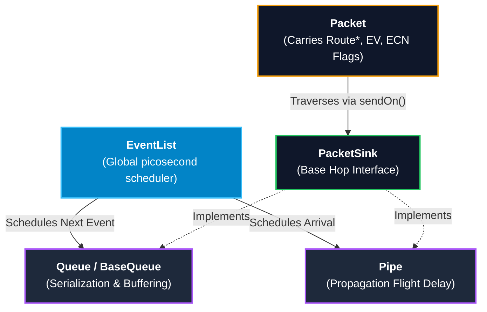
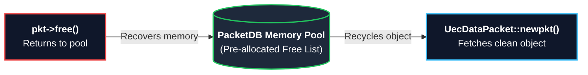
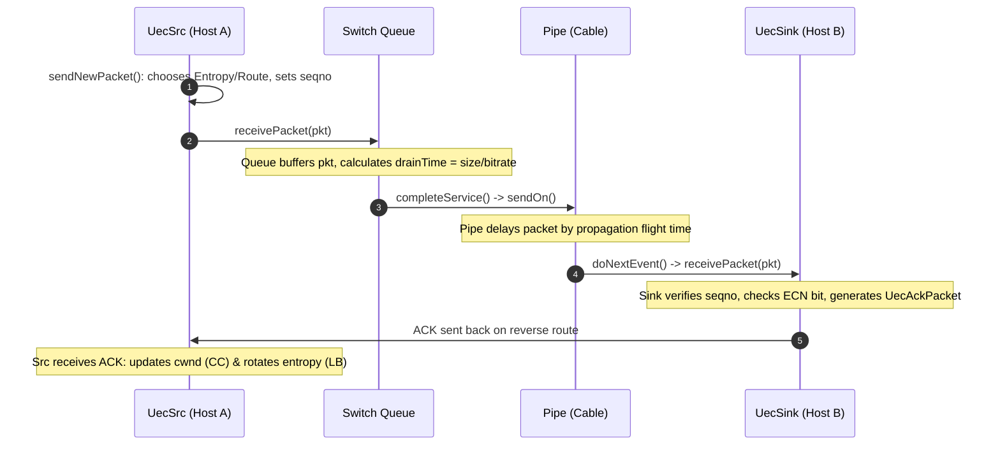
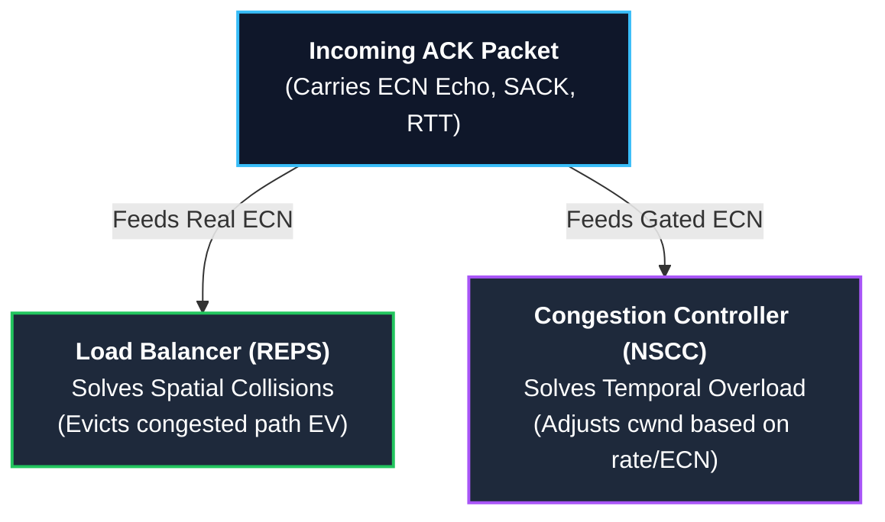
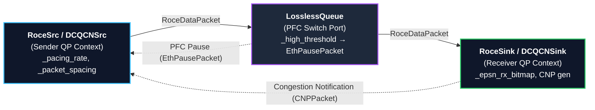

# HTSIM Simulation Tool: The Definitive Beginner's Guide

Welcome to the team! This guide is written specifically for you as a Junior Network Engineer. We will build your understanding from the ground up—starting with the fundamental concepts of network simulation, exploring the repository's architecture, dissecting multi-path routing (ECMP vs. SRv6), walking through RDMA/RoCEv2 and UEC transports, inspecting real C++ code snippets with line-by-line explanations, and finishing with practical developer workflows.

---

## Table of Contents
1. [Part 1: Network Simulation Fundamentals & Key Terms](#part-1-network-simulation-fundamentals--key-terms)
2. [Part 2: Directory Map & Code Structure](#part-2-directory-map--code-structure)
3. [Part 3: The Core Architecture & Memory Management](#part-3-the-core-architecture--memory-management)
4. [Part 4: The Engine Room — `EventList` and Virtual Time](#part-4-the-engine-room--eventlist-and-virtual-time)
5. [Part 5: How Packets & Multi-Path Routing are Modeled in Code](#part-5-how-packets--multi-path-routing-are-modeled-in-code)
6. [Part 6: The Physical Metaphor — Packets, Queues, Pipes, and Routes](#part-6-the-physical-metaphor--packets-queues-pipes-and-routes)
7. [Part 7: Step-by-Step Walkthrough: Life of a Packet & Traffic Matrices](#part-7-step-by-step-walkthrough-life-of-a-packet--traffic-matrices)
8. [Part 8: Load Balancing & Congestion Control in Depth (UEC / REPS)](#part-8-load-balancing--congestion-control-in-depth-uec--reps)
9. [Part 9: RDMA & RoCEv2 Architecture in HTSIM (QPs, Lossless Queues & DCQCN)](#part-9-rdma--rocev2-architecture-in-htsim-qps-lossless-queues--dcqcn)
10. [Part 10: Code Deep-Dives with Line-by-Line Explanations](#part-10-code-deep-dives-with-line-by-line-explanations)
11. [Part 11: Practical Developer Guide & Adding New Features](#part-11-practical-developer-guide--adding-new-features)
12. [Part 12: Simulation Output, Metrics & FCT Analysis](#part-12-simulation-output-metrics--fct-analysis)
13. [Part 13: Master Reference & Comparison Matrix](#part-13-master-reference--comparison-matrix)

---

## Part 1: Network Simulation Fundamentals & Key Terms

Before looking at C++ classes, let's understand *why* we simulate networks and the core terminology.

### Why Not Just Test on Real Hardware?
In modern data centers, networks run at 100 Gbps, 400 Gbps, or 800 Gbps with thousands of servers and switches. Building testbeds of this scale to test a new algorithm is:
- **Prohibitively expensive** (millions of dollars in switches, optics, cables, and NICs).
- **Hard to debug** (you cannot pause the universe to inspect a single queue at microsecond $14.2$).
- **Non-deterministic** (hard to reproduce an exact race condition or packet drop sequence).

A network simulator runs protocol logic on a standard workstation in a fully reproducible, deterministic software environment.

---

### What is Discrete-Event Simulation (DES)?

In a video game or real-time simulation, time advances continuously tick-by-tick (e.g., 60 frames/sec: $t=0, 16\text{ ms}, 32\text{ ms}, \dots$).

In **Discrete-Event Simulation (DES)**:
1. Nothing happens between events.
2. The simulation clock **jumps directly** from the timestamp of the current event to the timestamp of the next earliest event in a priority queue.
3. If a packet is transmitted at $t = 10\,\mu\text{s}$ and the wire delay is $5\,\mu\text{s}$, the simulator schedules a `ReceivePacket` event at $t = 15\,\mu\text{s}$ and immediately leaps to $t = 15\,\mu\text{s}$ (skipping all idle time in between).



---

### Key Networking Terminology

Here is a quick glossary of terms used all across HTSIM:

| Term | What It Means | Real-World Analog |
|---|---|---|
| **FCT (Flow Completion Time)** | Total time from when a sender initiates a flow until the last byte is acknowledged. Lower is better! | Delivery duration of a package. |
| **BDP (Bandwidth-Delay Product)** | $\text{Capacity} \times \text{RTT}$. The total number of bytes required to keep the network pipe 100% utilized. | The total volume of water inside a firehose. |
| **Transmission Delay** | Time to push all bits of a packet onto the wire: $\frac{\text{Packet Size (bits)}}{\text{Link Bandwidth (bps)}}$. | Time taken to push boxes through a doorway one by one. |
| **Propagation Delay** | Physical flight time of electromagnetic signals traveling through fiber/copper: $\approx 5\text{ ns/meter}$. | Travel time of a train between two stations. |
| **Queuing Delay** | Time a packet spends waiting in a switch buffer because the egress port is busy sending other packets. | Waiting in line at the grocery store checkout. |
| **RTT (Round-Trip Time)** | Total time for a packet to reach the destination plus the time for the ACK to return. | Sending a letter and receiving a reply. |
| **ECN (Explicit Congestion Notification)** | Switches mark bits in packet headers when queue occupancy exceeds a threshold, warning senders to slow down before packet drops occur. | A yellow caution light on a highway. |
| **ECMP (Equal-Cost Multi-Path)** | Switches hash packet headers (Src/Dst IP, Ports, Protocol + Entropy) to select one of several equal-cost next hops. | Picking a highway lane based on your license plate number. |
| **Fat-Tree Topology** | Hierarchical data center network structure (ToR/Leaf $\leftrightarrow$ Aggregation/Spine $\leftrightarrow$ Core) providing non-blocking bisection bandwidth. | A multi-lane pyramid highway system. |
| **Traffic Matrix (.tm)** | A file containing a list of all flows to simulate (Source, Destination, Volume in bytes, and Start Time). | A shipping manifest detailing all packages for the day. |

---

## Part 2: Directory Map & Code Structure

The repository is organized logically to separate the core C++ simulator from the scripts that run experiments and analyze results. 

Here is where everything lives:

```text
REPS_EuroSys_Artifact/
├── [htsim/sim/](./htsim/sim/)                  ← C++ simulator engine
│   ├── (core simulation files)  ← e.g., [queue.cpp](./htsim/sim/queue.cpp), [pipe.cpp](./htsim/sim/pipe.cpp), [eventlist.cpp](./htsim/sim/eventlist.cpp)
│   ├── [uec.h](./htsim/sim/uec.h) / [uec.cpp](./htsim/sim/uec.cpp) ← Transport (NSCC, Swift) + Load Balancing (REPS, FREEZING)
│   ├── [roce.h](./htsim/sim/roce.h) / [roce.cpp](./htsim/sim/roce.cpp) ← RDMA / RoCEv2 transport endpoints
│   ├── [dcqcn.h](./htsim/sim/dcqcn.h) / [dcqcn.cpp](./htsim/sim/dcqcn.cpp) ← DCQCN congestion control & CNP handling
│   ├── [queue_lossless.h](./htsim/sim/queue_lossless.h) ← PFC lossless queue with pause frame triggers
│   └── [datacenter/](./htsim/sim/datacenter/)             ← CLI entry points & topologies
│       ├── [main_uec.cpp](./htsim/sim/datacenter/main_uec.cpp)        ← Main UEC runner (our primary focus)
│       ├── [main_roce.cpp](./htsim/sim/datacenter/main_roce.cpp)      ← Main RoCEv2 / DCQCN runner
│       └── [fat_tree_topology.cpp](./htsim/sim/datacenter/fat_tree_topology.cpp) ← K-ary Fat-Tree graph builder
│
├── [state_aware_experiments/](./state_aware_experiments/)    ← OUR WORK (Extensions & Experiments)
│   ├── [workloads/](./state_aware_experiments/workloads/)              ← Synthetic Traffic Matrices shared across experiments
│   ├── [exp03_matrix_sweep_v3/](./state_aware_experiments/exp03_matrix_sweep_v3/)  ← Example: Full experiment with scripts, plots, and CSVs
│   └── [RUNNING_EXPERIMENTS.md](./state_aware_experiments/RUNNING_EXPERIMENTS.md)  ← Step-by-step guide for running sweeps
│
├── [artifact_scripts/](./artifact_scripts/)           ← The paper's ORIGINAL bash runners (DO NOT MODIFY)
├── [artifact_results/](./artifact_results/)           ← The paper's ORIGINAL results (DO NOT MODIFY)
└── [traffic_gen/](./traffic_gen/)                ← Python tools to generate custom Traffic Matrix (.tm) files
```

> [!IMPORTANT]
> **Repository Rules:**
> - If you are modifying transport logic, congestion control, or load balancing, edit [`./htsim/sim/`](./htsim/sim/).
> - If you are designing new experiment benchmarks, create a subfolder under [`./state_aware_experiments/`](./state_aware_experiments/).
> - **Never modify** [`./artifact_scripts/`](./artifact_scripts/) or [`./artifact_results/`](./artifact_results/) to preserve baseline paper reproducibility.

---

## Part 3: The Core Architecture & Memory Management

HTSIM is written in modular, object-oriented C++. Almost every physical concept in a network maps directly to a C++ class.



### The Core Class Hierarchy

1. **`EventSource`** ([`htsim/sim/eventlist.h`](./htsim/sim/eventlist.h)):
   - Base class for any simulation object that can trigger an action in the future.
   - Requires implementing `virtual void doNextEvent() = 0`.
2. **`PacketSink`** ([`htsim/sim/network.h`](./htsim/sim/network.h)):
   - Base interface representing any entity capable of receiving a packet.
   - Requires implementing `virtual void receivePacket(Packet& pkt) = 0`.
3. **`Pipe`** ([`htsim/sim/pipe.h`](./htsim/sim/pipe.h)):
   - Represents a physical cable. Inherits from both `PacketSink` (receives a packet at one end) and `EventSource` (delivers it at the other end after propagation delay).
4. **`Queue` / `BaseQueue`** ([`htsim/sim/queue.h`](./htsim/sim/queue.h)):
   - Represents a switch egress port buffer. Manages buffer capacity, drops or marks packets (ECN), and models transmission delay.
5. **`Route`** ([`htsim/sim/route.h`](./htsim/sim/route.h)):
   - An ordered list of `PacketSink*` pointers (`[HostQueue* -> Pipe* -> SwitchQueue* -> Pipe* -> ... -> Sink*]`).
6. **`Packet`** ([`htsim/sim/network.h`](./htsim/sim/network.h)):
   - Base message unit carrying packet headers, payload size, route pointer, flags (ECN), and path entropy.
7. **`UecSrc` & `UecSink`** ([`htsim/sim/uec.h`](./htsim/sim/uec.h)):
   - Modern transport layer endpoints (Ultra Ethernet Consortium style transport with NSCC congestion control and REPS load balancing).
8. **`RoceSrc` & `RoceSink`** ([`htsim/sim/roce.h`](./htsim/sim/roce.h)):
   - RDMA / RoCEv2 transport layer endpoints with hardware pacing and Go-Back-N / SACK retransmissions.

---

### High-Performance Packet Memory Management (`PacketDB`)

In high-throughput simulations, millions of packets are created and destroyed every second. Calling standard `new` and `delete` continuously would cause severe heap fragmentation and CPU overhead.

HTSIM solves this with a **memory pool / free-list** pattern called `PacketDB`:



```cpp
// NEVER call: delete pkt;
// ALWAYS call:
pkt->free(); // Returns the packet memory back to PacketDB for reuse
```

---

## Part 4: The Engine Room — `EventList` and Virtual Time

### Time Representation: Picoseconds
In high-speed networks (400 Gbps), a 4KB packet takes only ~80 nanoseconds to transmit. To eliminate floating-point rounding errors, HTSIM represents all virtual time internally as a 64-bit unsigned integer in **picoseconds** ($1\text{ ps} = 10^{-12}\text{ s}$):

- $1\text{ second (s)} = 10^{12}\text{ ps}$
- $1\text{ millisecond (ms)} = 10^9\text{ ps}$
- $1\text{ microsecond } (\mu\text{s}) = 10^6\text{ ps}$
- $1\text{ nanosecond (ns)} = 10^3\text{ ps}$

Helper functions in [`htsim/sim/config.h`](./htsim/sim/config.h) perform conversions:
```cpp
simtime_picosec t1 = timeFromUs(5);   // 5 microseconds -> 5,000,000 picoseconds
simtime_picosec t2 = timeFromNs(100); // 100 nanoseconds -> 100,000 picoseconds
double us = timeAsUs(t1);             // converts picoseconds back to double (5.0)
```

### How the `EventList` Priority Queue Works
The `EventList` contains an ordered priority queue (`std::multimap<simtime_picosec, EventSource*>`).

```cpp
// From htsim/sim/eventlist.cpp
bool EventList::doNextEvent() {
    if (_pendingsources.empty())
        return false; // Simulation finished!

    // 1. Get earliest pending event
    simtime_picosec nexteventtime = _pendingsources.begin()->first;
    EventSource* nextsource = _pendingsources.begin()->second;
    _pendingsources.erase(_pendingsources.begin());

    // 2. Leap global clock forward
    _lasteventtime = nexteventtime;

    // 3. Execute event
    nextsource->doNextEvent();
    return true;
}
```

The entire simulation is just a loop around this function in `main()`:
```cpp
while (eventlist.doNextEvent()) {
    // Keep running until time limit or all events complete
}
```

---

## Part 5: How Packets & Multi-Path Routing are Modeled in Code

In real-world networks, packets carry large headers (Ethernet MAC addresses, IPv4/IPv6 addresses, TCP ports). Simulating these byte-by-byte consumes unnecessary memory and compute.

### 1. Minimal Headers & Addressing
HTSIM strips networking down to the bare essentials:
- There is no `struct ip_hdr` or `struct tcp_hdr`.
- `UecDataPacket`, `RoceDataPacket`, and ACK packets inherit from a lightweight `Packet` base class.
- **Addresses**: There are no MAC or IP addresses. Endpoints are simply integers (Host 0 through Host $N-1$).
- **Flow Identity**: Flows are identified by an integer `_flow_id`.
- **Sequence Numbers**: The transport protocol uses `_epsn` (Expected Packet Sequence Number) instead of byte-based TCP sequence numbers.

---

### 2. Multi-Path Topology: 3-Tier Fat-Tree (K=4)

Below is an animated view of packets traversing multiple redundant bisection paths in a 3-Tier Fat-Tree network:



---

### 3. Per-Hop ECMP vs. Explicit SRv6 Source Routing

| Routing Mode | How It Works | Switch Behavior | Packet Route Field |
|---|---|---|---|
| **Standard ECMP** (Default) | Sender attaches Entropy Value (EV) to `pkt.set_pathid(ev)`. | Switch hashes `(src, dst, ev)` at each hop to choose an egress port. | Hop-by-hop resolution. |
| **SRv6 Source Routing** (`-use_srv6`, `path_rr`) | Sender pre-calculates all distinct physical paths via `topo->get_bidir_paths()`. The EV directly indexes the path (`ev % paths.size()`). | Switches do **no hashing**; they simply forward to the next hop in the route. | Fully populated explicit `Route*`. |

> [!NOTE]
> **SRv6 Implementation Note**: The SRv6 explicit source routing mechanism and `path_rr` were implemented independently in this repository (not part of the original REPS EuroSys paper) to enable precise, hash-collision-free path testing.

---

## Part 6: The Physical Metaphor — Packets, Queues, Pipes, and Routes

Let's see how physical network components are modeled in software.



### 1. `Pipe`: The Wire (Propagation Delay)
A `Pipe` holds a packet for a fixed duration ($\text{delay}$) and delivers it to the next hop:

```cpp
// When a packet enters the cable:
void Pipe::receivePacket(Packet& pkt) {
    if (_failed) { // Simulated link failure / cut cable
        pkt.free();
        return;
    }
    // Schedule arrival at (current_time + propagation_delay)
    simtime_picosec arrival_time = eventlist().now() + _delay;
    _inflight_v.push_back({arrival_time, &pkt});
    eventlist().sourceIsPending(*this, arrival_time);
}

// When the arrival time is reached:
void Pipe::doNextEvent() {
    Packet* pkt = _inflight_v[_next_pop].pkt;
    _next_pop++;
    pkt->sendOn(); // Advance to the next hop in its Route
}
```

### 2. `Queue`: The Switch Buffer (Transmission Delay & ECN)
A `Queue` holds packets when the egress link is busy, drains them at the link's line rate, and drops or marks them if congested.

1. **`receivePacket(pkt)`**:
   - Check if queue is full (`_queuesize + pkt.size() > _maxsize`). If full, drop the packet (or trim it).
   - If queue is empty and transmitter is idle, call `beginService()`.
   - Otherwise, push `pkt` into the FIFO buffer `_enqueued`.
2. **`beginService()`**:
   - Calculate serialization time: $\text{drainTime} = \frac{\text{packet size} \times 8}{\text{bitrate}}$.
   - Schedule `doNextEvent()` at `now() + drainTime`.
3. **`completeService()` (in `doNextEvent()`)**:
   - The packet has completely exited the transmitter.
   - Check ECN marking: if buffer occupancy exceeds `ecn_thresh`, mark the packet: `pkt.set_flags(pkt.flags() | ECN_CE)`.
   - Forward the packet: `pkt.sendOn()`.
   - If more packets remain in `_enqueued`, start servicing the next one (`beginService()`).

---

## Part 7: Step-by-Step Walkthrough: Life of a Packet & Traffic Matrices

### 1. Anatomy of a Traffic Matrix (`.tm`) File

Simulations are driven by workload files called Traffic Matrices (`.tm`). Each line represents a flow:

```text
# src  dst  size_bytes  start_time_ps
0      15   1048576     0
1      14   524288      1000000
2      13   65536       2500000
```
- **`src`**: Source host index (e.g., Host 0).
- **`dst`**: Destination host index (e.g., Host 15).
- **`size_bytes`**: Flow payload size in bytes (e.g., 1 MB).
- **`start_time_ps`**: Start timestamp in picoseconds ($0 = 0\,\mu\text{s}$, $1000000 = 1\,\mu\text{s}$).

---

### 2. End-to-End Packet Lifecycle



1. **Flow Launch**: At `start_time_ps`, `UecSrc::doNextEvent()` awakens and sends packets up to Congestion Window (`_cwnd`).
2. **Entropy Selection**: The sender selects an Entropy Value (EV) from its load balancer (e.g. `freezing`).
3. **Hop-by-Hop Delivery**: Each hop calls `pkt.sendOn()`, which increments `_nexthop` and forwards to the next `PacketSink`.
4. **ACK Generation**: `UecSink` creates a `UecAckPacket` containing cumulative ACKs, SACK bitmap, and ECN-Echo flag.
5. **ACK Processing**: `UecSrc::processAck()` adjusts `_cwnd` (congestion control) and updates its entropy table (load balancing).

---

## Part 8: Load Balancing & Congestion Control in Depth (UEC / REPS)

Understanding how Transport and Load Balancing interact in HTSIM is essential for working with this repository.



---

### The REPS / FREEZING 8-Slot Circular Buffer

The core REPS algorithm (`-load_balancing_algo freezing`) maintains a small bounded buffer of active Entropy Values (default 8 slots):



1. **Clean ACK**: The path has no queue buildup. The EV is recycled to the tail of the buffer to continue using this good path.
2. **ECN-Marked ACK**: A switch along this path is congested. The EV is immediately **evicted**, and a brand new random EV is drawn to explore an alternate path.
3. **Entropy Lifetime Bounding (`-reps_entropy_lifetime`)**: In the extended REPS implementation, an EV is forcefully refreshed after $N$ uses to prevent permanent path lock-in when network state shifts.

---

### Congestion Control (NSCC & Swift)

- **NSCC (Network State Congestion Control)**: Multi-stage rate adjustment responding to ECN and base RTT.
- **Swift**: Delay-based congestion control computing target queuing delay:
  $$\text{target delay} = \text{target Qdelay} + \text{topology delay}$$

---

## Part 9: RDMA & RoCEv2 Architecture in HTSIM (QPs, Lossless Queues & DCQCN)

While modern Ultra Ethernet (UEC) uses packet spraying and trimming, understanding **RDMA (Remote Direct Memory Access)** and **RoCEv2** is essential, as HTSIM includes full support for both models.



---

### 1. RDMA Fundamentals for Beginners
In traditional TCP/IP networking, every packet requires CPU interrupts, context switches, and multiple data copies (User Memory $\rightarrow$ Kernel Socket Buffer $\rightarrow$ NIC Ring Buffer).

**RDMA eliminates this overhead through two core features:**
1. **Zero-Copy**: The network interface card (RNIC) reads/writes data directly to/from application memory via DMA (Direct Memory Access).
2. **Kernel / OS Bypass**: Applications post network tasks directly to hardware without issuing OS system calls.

#### What is a Queue Pair (QP)?
In RDMA, communication occurs over a **Queue Pair (QP)** allocated in RNIC hardware:
- **Send Queue (SQ)**: The sender posts Work Queue Elements (WQEs) describing memory to transmit.
- **Receive Queue (RQ)**: The receiver posts WQEs describing destination buffers for incoming data.
- **Completion Queue (CQ)**: When a transfer finishes, the RNIC writes a Completion Queue Element (CQE).

---

### 2. How RDMA is Modeled in HTSIM Code



1. **`RoceSrc`** ([`./htsim/sim/roce.h`](./htsim/sim/roce.h)):
   - Models the sending QP and hardware rate pacing.
   - Computes packet transmission intervals based on line rate or congestion pacing:
     $$\text{\_packet\_spacing} = \frac{(\text{Packet Size} + \text{ACKSIZE}) \times 8 \times 10^{12}}{\text{\_pacing\_rate}}$$
   - Manages sequence numbers (`_highest_sent`, `_last_acked`) and Go-Back-N / Selective ACK retransmissions.
2. **`RoceSink`** ([`./htsim/sim/roce.h`](./htsim/sim/roce.h)):
   - Models the destination QP.
   - Tracks received packets via `_cumulative_ack` and an Out-of-Order bitmap `_epsn_rx_bitmap` (up to `roceMaxReorder = 64`).
   - Generates `RoceAck` and `RoceNack` packets.

---

### 3. Lossless Operation & PFC (Priority Flow Control)

Traditional RoCEv2 relies on a **Lossless Ethernet Fabric** to avoid expensive Go-Back-N packet drop recovery.

In HTSIM, this is modeled by [`LosslessQueue`](./htsim/sim/queue_lossless.h):
- When buffer occupancy exceeds `_high_threshold`, the queue triggers an [`EthPausePacket`](./htsim/sim/eth_pause_packet.h) back to the upstream queue/sender.
- The upstream transmitter pauses (`_state_send = PAUSED`) and stops pushing packets.
- When the buffer drains below `_low_threshold`, normal transmission resumes (`_state_send = READY`).

> [!WARNING]
> **The Danger of PFC**: If pause frames cascade across multiple switch tiers, it can cause **PFC Deadlocks** and **Head-of-Line (HoL) Blocking**, stalling unrelated flows across the entire cluster.

---

### 4. DCQCN Congestion Control

To prevent PFC pause frames from triggering, RoCEv2 networks run **DCQCN (Data Center Quantized Congestion Notification)**:

1. Switches mark data packets with ECN when buffers start to fill (before hitting PFC thresholds).
2. [`DCQCNSink`](./htsim/sim/dcqcn.h) detects the ECN marks and sends a Congestion Notification Packet ([`CNPPacket`](./htsim/sim/cnppacket.h)) back to the sender at bounded intervals (`_cnp_interval`).
3. [`DCQCNSrc`](./htsim/sim/dcqcn.h) receives the CNP and cuts its current rate $R_C$ using a multiplicative factor $\alpha$:
   $$R_C = R_C \times (1 - \alpha / 2)$$
4. A periodic timer gradually updates $\alpha$ and initiates Fast Recovery and Active Increase to reclaim bandwidth.

---

### 5. Architectural Comparison: RoCEv2 vs. Ultra Ethernet (UEC)

| Feature | RoCEv2 (`main_roce.cpp`) | Ultra Ethernet / UEC (`main_uec.cpp`) |
|---|---|---|
| **Underlying Fabric** | Lossless (Requires PFC Pause Frames) | Lossy Standard Ethernet (No PFC needed) |
| **Packet Drops** | Catastrophic (triggers PFC or Go-Back-N) | Handled smoothly via Packet Trimming |
| **Multi-Pathing** | Flow-pinned ECMP (avoids reordering) | Per-packet spraying + REPS Entropy Recycling |
| **Congestion Control** | DCQCN (CNP generation at receiver) | NSCC / Swift (Fast RTT + ECN in ACK) |
| **Deadlock Risk** | High (PFC pause frame loops) | Zero (no pause frames) |

---

## Part 10: Code Deep-Dives with Line-by-Line Explanations

Let's look at real snippets from the codebase and explain each line.

### Code Snippet 1: The State-Aware ECN Gating Gate in [`uec.cpp`](./htsim/sim/uec.cpp)
This snippet from [`htsim/sim/uec.cpp`](./htsim/sim/uec.cpp) shows how the State-Aware architecture splits ECN signals between the load balancer and congestion controller:

```cpp
// 1. Check if the incoming packet carried an ECN mark
bool ecn = (pkt.flags() & ECN_CE) || (pkt.flags() & ECN_CA);

// 2. The Load Balancer ALWAYS gets the real ECN feedback
processEv(pkt.pathid(), ecn); 

// 3. Gating logic for the Congestion Controller:
bool cc_ecn = ecn;
if (_state_aware_ecn_enabled) {
    // In state-aware mode, only slow down the CC if the network has asymmetric capacity (e.g. failed link)
    // Otherwise, let the load balancer fix transient collisions without dropping transmission rate!
    cc_ecn = ecn && _network_is_asymmetric;
}

// 4. Update the Congestion Window
updateCwndOnAck(pkt, cc_ecn);
```

**Why this matters**: In symmetric networks, transient congestion is often just two packets colliding on the same hash bucket. The load balancer can spray to a different path immediately. Slashing `_cwnd` unnecessarily hurts throughput!

---

### Code Snippet 2: PFC Pause Frame Generation in [`queue_lossless.cpp`](./htsim/sim/queue_lossless.cpp)
This snippet shows how switches generate PFC pause frames when buffer watermarks are breached:

```cpp
void LosslessQueue::receivePacket(Packet& pkt) {
    // 1. Check if queue size crossed the high watermark threshold
    if (_queuesize + pkt.size() > _high_threshold && _state_recv != PAUSE_RECEIVED) {
        // High watermark breached! Send PFC Pause to upstream link
        EthPausePacket* pause_pkt = EthPausePacket::newpkt(1000, get_id());
        getRemoteEndpoint()->receivePacket(*pause_pkt);
        _state_recv = PAUSE_RECEIVED; // Mark queue as currently paused
    }

    // 2. Enqueue the data packet without dropping (Lossless guarantee)
    _enqueued.push_front(&pkt);
    _queuesize += pkt.size();

    // 3. Begin transmission if transmitter is idle and not paused
    if (_state_send == READY && _sending == 0) {
        beginService();
    }
}
```

---

### Code Snippet 3: Dynamic Link Failure in [`pipe.cpp`](./htsim/sim/pipe.cpp)
This snippet from [`htsim/sim/pipe.cpp`](./htsim/sim/pipe.cpp) models a sudden fiber cut or switch failure:

```cpp
void Pipe::receivePacket(Packet& pkt) {
    // If this link is currently broken, drop the packet immediately
    if (_failed) {
        pkt.free(); // Return packet to the memory pool
        return;
    }

    // Otherwise, calculate arrival time at the other end of the wire
    simtime_picosec arrival_time = eventlist().now() + _delay;
    _inflight_v.push_back({arrival_time, &pkt});

    // Register this pipe with the EventList to awaken at arrival_time
    eventlist().sourceIsPending(*this, arrival_time);
}
```

---

### Code Snippet 4: Fast Increasing & Multiplicative Decrease in [`uec.cpp`](./htsim/sim/uec.cpp)
Here is how NSCC adjusts `_cwnd` on ACK arrival:

```cpp
void UecSrc::updateCwndOnAck_NSCC(const UecAckPacket& pkt, bool ecn) {
    if (ecn) {
        // Congestion detected: Multiplicative Decrease (MD)
        // Ensure cwnd doesn't drop below min_cwnd
        _cwnd = std::max(_min_cwnd, (uint32_t)(_cwnd * (1.0 - _mult_decrease_scaling_factor)));
        _last_decrease = eventlist().now();
    } else {
        // Path is clear: Additive / Fast Increase (AI)
        if (_cwnd < _ssthresh) {
            _cwnd += _mss; // Exponential / fast growth below slow-start threshold
        } else {
            _cwnd += (_mss * _mss) / _cwnd; // Linear growth (1 MSS per RTT)
        }
    }
}
```

---

## Part 11: Practical Developer Guide & Adding New Features

### 1. Developing using Docker (Highly Recommended)

```bash
# 1. Build the self-contained Ubuntu development image
docker compose build

# 2. Run a shell inside the container (bind-mounts your current directory)
docker compose run --rm reps-artifact-dev
```

> [!CAUTION]
> **The Docker Rebuild Gotcha**: When you bind-mount your local repository into the Docker container, any `.o` (object files) or binaries (`htsim_uec`) that you compiled previously on your host OS will overwrite the container's directory.
> 
> **Always run `make clean` and `make` INSIDE the Docker container right after starting it** to avoid `GLIBCXX_ version not found` runtime crashes.

```bash
# Inside Docker container:
cd htsim/sim
make clean && cd datacenter && make clean && cd ..
make -j$(nproc)
cd datacenter && make -j$(nproc)
cd ../../..
```

---

### 2. How to Add Your First Custom Feature in 4 Steps

Here is the exact recipe for adding a new feature (e.g. a new flag `-my_custom_feature`):

#### Step 1: Add the CLI argument in [`datacenter/main_uec.cpp`](./htsim/sim/datacenter/main_uec.cpp)
```cpp
bool my_custom_feature = false;
// Inside the argument parsing loop:
else if (!strcmp(argv[i], "-my_custom_feature")) {
    my_custom_feature = true;
    i++;
}
```

#### Step 2: Pass the setting to `UecSrc` in [`datacenter/main_uec.cpp`](./htsim/sim/datacenter/main_uec.cpp)
```cpp
uecSrc->set_my_custom_feature(my_custom_feature);
```

#### Step 3: Define the setter & logic in [`uec.h`](./htsim/sim/uec.h) and [`uec.cpp`](./htsim/sim/uec.cpp)
```cpp
// In uec.h:
void set_my_custom_feature(bool enabled) { _my_custom_feature = enabled; }
bool _my_custom_feature = false;

// In uec.cpp:
if (_my_custom_feature) {
    // Custom protocol logic here!
}
```

#### Step 4: Recompile and Test!
```bash
cd htsim/sim && make -j$(nproc) && cd datacenter && make -j$(nproc) && cd ../..
./htsim/sim/datacenter/htsim_uec -my_custom_feature ...
```

---

## Part 12: Simulation Output, Metrics & FCT Analysis

### 1. Understanding Standard Output
When `htsim_uec` executes a simulation, it outputs flow lifecycle events:

```text
Flow 0 started at 0 ps
Flow 1 started at 1000000 ps
Flow 0 finished at 84200000 ps, FCT 84200000 ps (84.2 us)
Flow 1 finished at 92100000 ps, FCT 91100000 ps (91.1 us)
```

### 2. Key Metrics to Measure
- **Mean FCT**: Average Flow Completion Time across all flows in the matrix.
- **p99 Tail FCT**: The 99th percentile Flow Completion Time. This measures how badly the slowest 1% of flows suffered from congestion or hash collisions.
- **Throughput**: Total bytes transmitted divided by total simulation time.

---

## Part 13: Master Reference & Comparison Matrix

### 1. Comprehensive Feature & Algorithm Comparison Matrix

| Component | Flag / Value | Description | Implemented In |
|---|---|---|---|
| **Congestion Control** | `-sender_cc_algo nscc` | Network State Congestion Control (ECN + Multi-stage rate) | Base Simulator |
| | `-sender_cc_algo swift` | Delay-based Congestion Control (Target Queuing Delay) | Base Simulator |
| | `DCQCNSrc` / `DCQCNSink` | Data Center QCN (CNP-based rate adjustments for RoCEv2) | Base Simulator |
| **Load Balancing** | `-load_balancing_algo ecmp` | Static flow hashing (all packets of flow take 1 path) | Base Simulator |
| | `-load_balancing_algo random` | Per-packet uniform random entropy | Base Simulator |
| | `-load_balancing_algo freezing` | REPS paper bounded circular buffer (8-slot EV recycling) | REPS Paper |
| | `-load_balancing_algo path_rr` | True round-robin over distinct physical paths (SRv6-based) | Our Repo |
| | `-load_balancing_algo path_random`| Random path selection over pre-computed physical routes | Our Repo |
| | `-load_balancing_algo path_static`| Pinned physical path per flow | Our Repo |
| **Routing Substrate** | `-use_srv6` | Source-routed SRv6 uSID path selection (bypasses switch ECMP) | Our Repo |
| **State-Aware Extensions** | `-state_aware_ecn` | Gated CC response: ignores ECN on symmetric networks | Our Repo |
| | `-smart_filter_mode <1-3>` | Multi-mode ECN filter (drop-all, drop-single, drop-periodic)| Our Repo |
| | `-wtd_in_nscc` | Waiting-Time Drop rate adjustments in NSCC | Our Repo |
| | `-reps_entropy_lifetime <N>`| Maximum packet usage before an EV is forcefully refreshed | Our Repo |
| **Fabric Type** | `LosslessQueue` | Priority Flow Control (PFC pause frames on `_high_threshold`) | Base Simulator |

---

### 2. Golden Rules & Gotchas
1. **The Leaf-ECN Rule**: Whenever you pass `-sender_cc_only`, you **must** also pass `-disable_tor_ecn`. If you forget, ToR switches mark packets mistakenly and inflate flow completion times!
2. **Deterministic Debugging**: HTSIM simulations are deterministic given the same `-seed <N>` and parameters. If you see an unexpected drop at $t = 142.5\,\mu\text{s}$, running with the same seed will reproduce it at the exact picosecond.
3. **Never `sleep()`**: Never use system sleep or wall-clock timers in simulation code; always schedule an `EventSource` with `eventlist.sourceIsPending(...)`.
4. **Memory Management**: Packets are constantly allocated and freed. Always call `pkt->free()` instead of `delete pkt` to return objects to `PacketDB`.
5. **Mutually Exclusive Flags**: `-state_aware_ecn`, `-smart_filter_mode`, and `-wtd_in_nscc` are mutually exclusive. Enabling more than one at a time will cause a runtime assertion failure.

---

*You are now equipped with everything you need to understand, run, debug, and extend HTSIM! Welcome aboard!*
